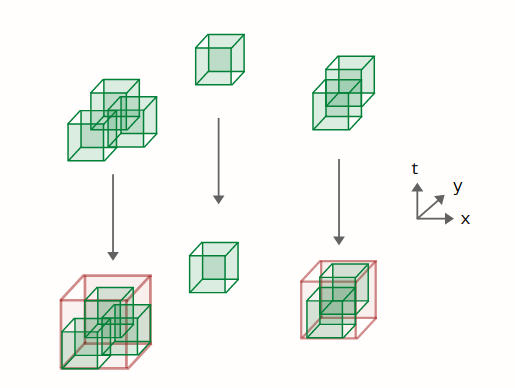

# Background

## Problem Statement

I work for a small government contractor (ICR, Inc) that specializes in software and data science solutions for the intelligence and defense community.

A stakeholder has a need to make hundreds of thousands of queries to databases with a time and space buffer. In other words, query the database with: lon_min, lon_max, lat_min, lat_max, time_min, time_max, and receive all data from that time and space. Due to database rules and constraints, the analyst is unable to fulfill their requests in a timely manor. The data-points are often very close together and thus there is room to merge and optimize the search in 3-D space

**Goal -- Reduce the total number of queries and the query volume of the search space**

## Big Picture Approach

An analyst should be able to follow the below steps for this task. My main work shown in this project is around step 2 of this task:

1. Pip install library
2. Run python script which uses the developed greedy algorithm
- Inputs
   - csv/excel location
   - lat,lon,time mappings
   - output location
   - temporal/space buffers
   - job name
   - justification
- Outputs
   - csv & kml with new queries

3. Analyst then can view the updated queries in Google Earth with the kml, if happy with the results they can move on to step 4
4. Run a downloader script which will actually send the queries to the database
- Inputs
    - csv file from step 2
- Outputs
    - database queried data (csv's)