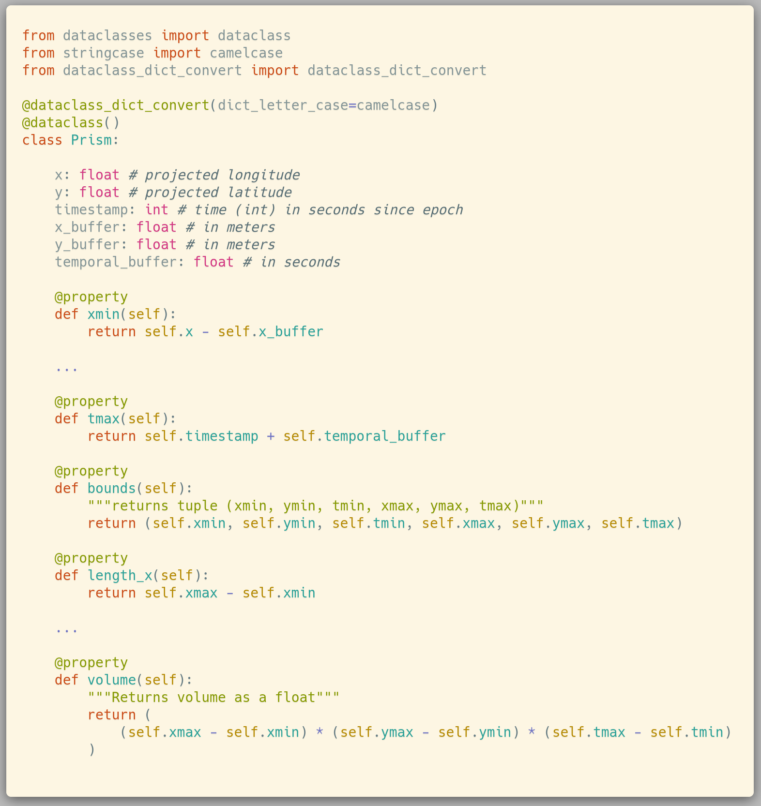
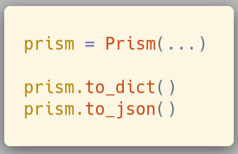
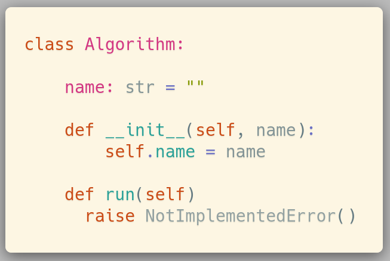
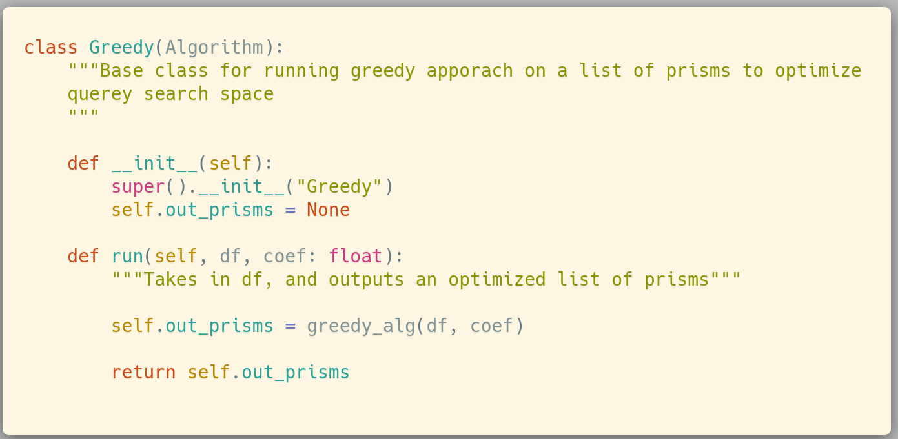
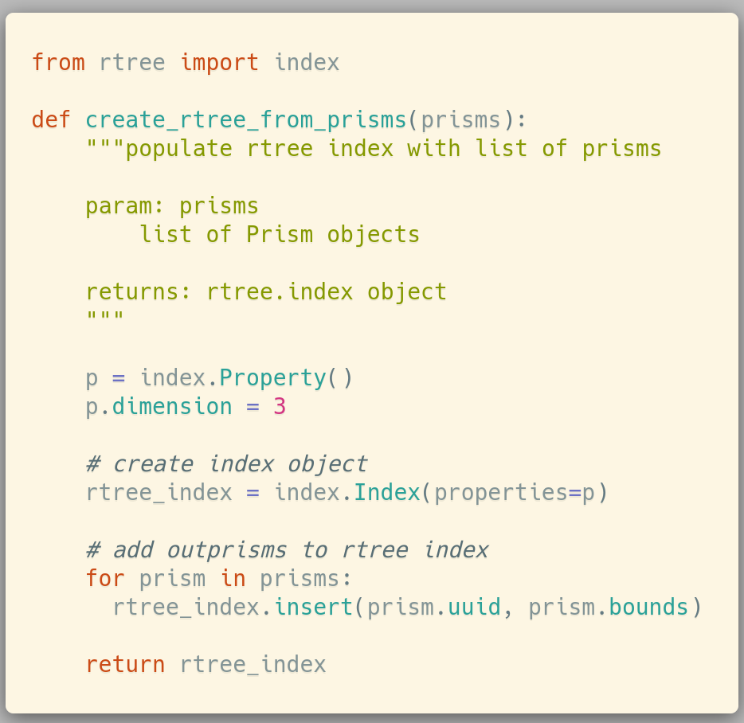
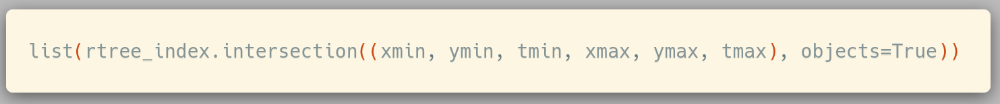
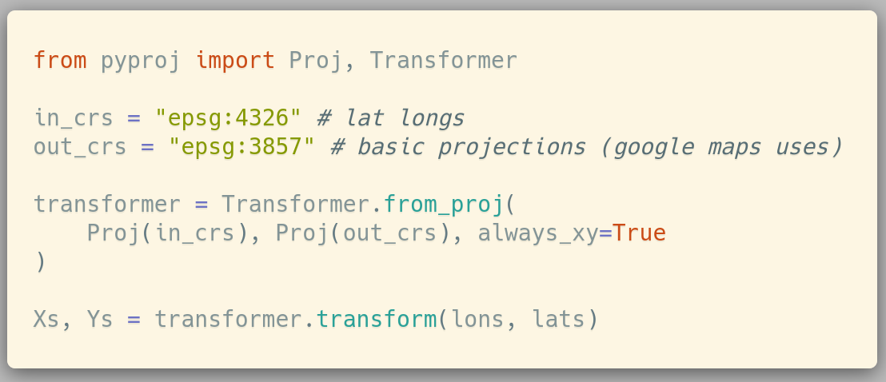
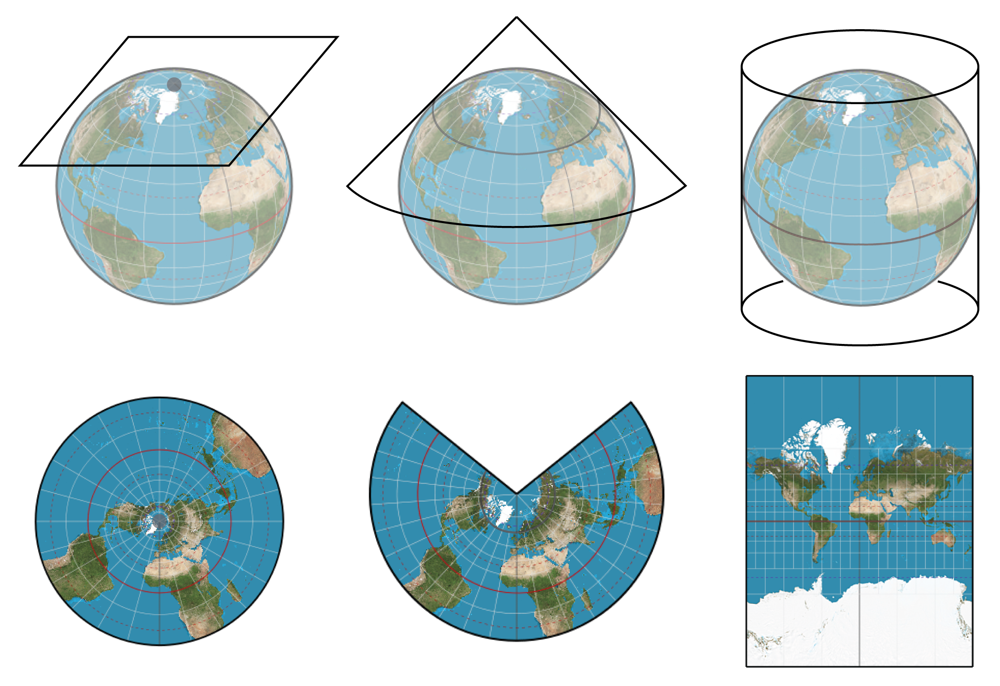

# Design Decisions

This page will take you thorugh some of the advanced python tools used in the final project that were learned in this class. I also share a few very useful libraries that I think students will be interested in for their future work!

## Decorators

### Dataclass Decorator
The dataclass decorator is very useful when working with classes that are primarily data. In this example the main object that I am doing work in pretty much just dat. I created a Prism object which allows for simple cacluation on a rectangular prism.

### Data-class Dict Convert Decorator
When using the dataclass, pairing it with the dataclass_dict_convert decorator allows for straightforward conversion to json and dict. See the below example for how easy this is. This take away the need to create your own serailize methods.

### Property Decorator
I think this one is prety obvious and well understood, but these methods are really just properties of the class, and thus are treated as that with the property decorator.

## Abstract Classes
Abstract classes can be great ways of demonstrating to other users which methods need to be implmented to run their algorithms within a framework that is being developed. In this case, in anticipation that other algorithms will be written with some of the base classes that have already been created, I created a base Algorithm class which for now is just saying that other algorithms should implement (override) the run method from Algorithm and implement it for their particular case. In the example outputs below you can see this being done within the Greedy class which inherits from Algorithm.

## Useful Libraries
During this project, there were a couple of advnaced libraries that played a key role in this project, and I though it would be useful to share these with other students in the class as well as TA's.

### Rtree
Rtree is an advanced spatial indexeing library. This means that you can create an index with their library which will create the spatial landscape of your data in 2d or 3d. For the data I was working with (x,y,time) a 3d rtree.index was needed. In order to reduce the number of queries, it was needed to find overlapping queries. Rtree provides a method `intersection` which does just that. You provide it a set of bounds (xmin, ymin, tmin, xmax, ymax, tmax) and it responds with all of the intersecting bounds. This was very helpful and would have been cumbersome to code ourselves. See the below output for an example.

### Pyproj
Another very complex thing to note when working with latitudes and longitudes is that the Earth is a sphere, but a lot of the caclulations that we want to perform a lot easier when done on a cartesian grid. Pyproj is a cartographic projections and coordinate transformations library. This means that given a latitude and longitude we can use pyproj to conver it to an x,y cartisian system. Depending on where your data is, it may make sense to use one projection over another. For simplicity the transformation to `epsg:3857` is the standard transformation that Google Maps uses. The projection for lat longs is `espg:4326`. To see how you go from one to another see the output code below. The diagram shows some common projected systems. Note that if your data is very far North, you wouldn't want to use the transformation discussed before as it will give you a distorted view of the globe!

