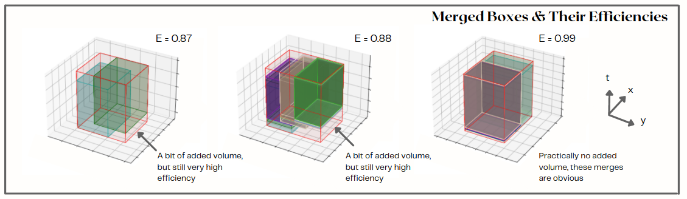
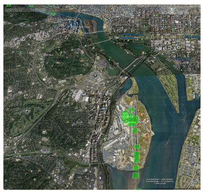
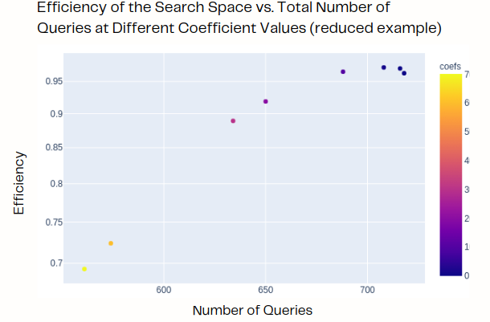

# Visualization

## Micro Level Analysis
As with most projects -- analysts, engineers, and scientists want to see that the algorithm is working in a visual representation. These visualizations were created in MatplotLib to show the Merged Boxes (in red) and the boxes that made them up. An efficiency for each Merged Box is also made to provide a metric for the overall algorithm (this is related to the volume of space that would not have been queried if the original data had been queried)

## Macro Level Analysis
Generating kml is simple, but powerful, and useful for analysts to view in Google Earth. The image shows the 2d boxes plotted at DCA airport. 

## Optimization Chart
Plotly was also used for interactive visualizations. If necessary, a tunable coefficient value exists to allow the user to decrease the number of overall queries at the cost of some query efficiency. Visualizing this experiment was important to allow the analyst to make a decision about what ratio of efficiency to number of queries they wanted to take

